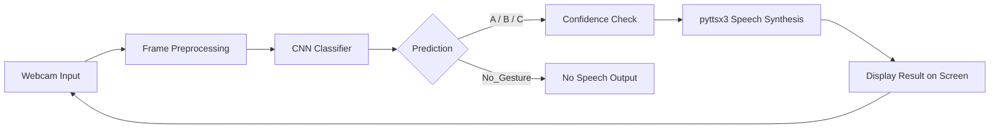

# MudraAI
# Vision-Based Real-Time Gesture-to-Speech Translation

A webcam-based gesture-to-speech application that recognizes the static hand signs **A**, **B**, and **C**. A CNN classifies each frame and PyTTSX3 speaks recognized gestures. A fourth `No_Gesture` class prevents empty frames from being incorrectly treated as signs.

## Features

- Real-time webcam prediction for A, B, C, and `No_Gesture`
- Confidence score displayed on screen
- Text-to-speech output for A, B, and C
- No speech for `No_Gesture`
- CNN training pipeline with normalization, augmentation, validation split, early stopping, and checkpointing

## Tech Stack

- Python 3.x
- OpenCV for live webcam capture and image preprocessing
- TensorFlow / Keras for CNN model training and inference
- NumPy for numerical image processing
- pyttsx3 for offline text-to-speech conversion
- Matplotlib / image utilities for training visualization and evaluation

## System Architecture

The system follows a simple vision-to-speech pipeline:



The application captures a live frame, resizes it to 64 x 64, normalizes pixel values, and sends it to the trained CNN. If the predicted class is one of A, B, or C and the confidence is above the defined threshold, the system speaks the recognized gesture using a text-to-speech engine.

## How It Works

1. The webcam captures a live image frame.
2. The frame is resized and normalized to match the CNN input format.
3. The trained model predicts one of four classes: A, B, C, or `No_Gesture`.
4. The predicted class and confidence score are displayed on the screen.
5. If the class is `No_Gesture`, the system remains silent.
6. If the gesture is A, B, or C and the confidence is sufficiently high, the corresponding word is spoken aloud.
7. The loop continues until the user presses `Q` to exit.

This design ensures that the application reacts in real time while preventing false speech outputs from irrelevant frames.

## Dataset

The dataset is organized as follows:

```text
dataset/
|-- A/              3,000 images
|-- B/              3,000 images
|-- C/              3,000 images
`-- No_Gesture/       500 images
```

The A, B, and C gesture images are sourced from the [ASL Alphabet Dataset on Kaggle](https://www.kaggle.com/datasets/grassknoted/asl-alphabet?resource=download). `No_Gesture` images were captured locally and include frames without A/B/C signs. During training, `No_Gesture` is weighted to compensate for its smaller size.

## Model

Input frames are resized to **64 x 64** and normalized to the range 0–1. The model uses:

```text
Input (64 x 64 x 3)
  -> random rotation and translation during training
  -> Conv2D (16) + max pooling
  -> Conv2D (32) + max pooling
  -> Conv2D (64)
  -> global average pooling
  -> Dense (64) + dropout (0.35)
  -> Softmax output (A / B / C / No_Gesture)
```

The model is optimized with Adam (`learning_rate=0.001`). The best validation-loss checkpoint is saved to `models/gesture_model.keras`.

## Results

The trained model correctly recognized each gesture in the live webcam test. The screenshots below show the application output.

| A | B |
|---|---|
|  |  |

| C | No Gesture |
|---|---|
|  |  |

The best random held-out validation split reached **100.00% accuracy**. This score reflects images from the collected dataset; live performance can still vary with lighting, background, camera angle, and hand position.

## How to Run

From the `gesture-to-speech-cnn` directory:

```powershell
cd gesture-to-speech-cnn
python -m venv venv
.\venv\Scripts\Activate
python -m pip install -r requirements.txt
```

The trained model is already available, so start the application with:

```powershell
python app.py
```

Press `Q` in the webcam window to quit.

### Collecting Additional Images

```powershell
python capture_data.py
python nogesture_capture.py
```

If you add or change dataset images, retrain the model:

```powershell
python train.py
```

## Project Structure

```text
gesture-to-speech-cnn/
|-- assets/results/       # Live prediction screenshots
|-- dataset/              # A, B, C, and No_Gesture images
|-- models/               # Saved Keras model
|-- references/           # Academic reference PDF
|-- app.py                # Real-time gesture-to-speech application
|-- capture_data.py       # A/B/C data collection
|-- nogesture_capture.py  # No_Gesture data collection
|-- train.py              # Model training
`-- requirements.txt
```

## Student Details

- Student Name: Navya Roshni
- Roll No.: 5024142
- Semester: V
- Academic Year: 2026-2027
- Subject: AI
- Project Title: MudraAI
- Github Repository: https://github.com/c0dengineer

## Reference

This project is inspired by:

Gogoi, P., Karsh, B., Karsh, R. K., Laskar, R. H., & Bhuyan, M. K. (2025). *Vision-Based Real-Time Gesture-to-Speech Translation for Sign Language*. Procedia Computer Science, 258, 2050–2059. https://doi.org/10.1016/j.procs.2025.04.455

The supplied paper is included in this repository: [Vision-Based Real-Time Gesture-to-Speech Translation for Sign (PDF)](references/Vision-Based-Real-Time-Gesture-to-Speech-Translation-for-Sign.pdf).

### Dataset Reference

Akash Nag. *ASL Alphabet*. Kaggle. https://www.kaggle.com/datasets/grassknoted/asl-alphabet

The A, B, and C images used by this project are derived from this dataset. `No_Gesture` images were collected locally for this project.

This is a small academic implementation.
