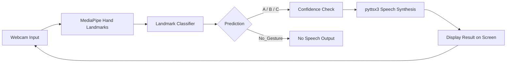
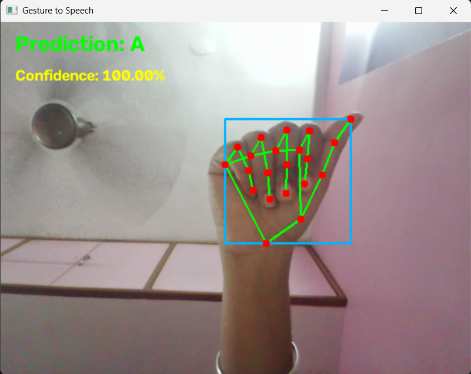
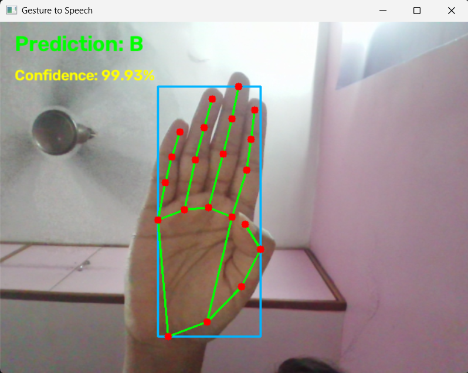
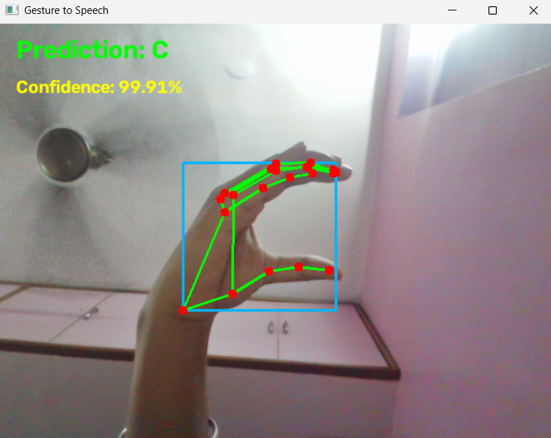
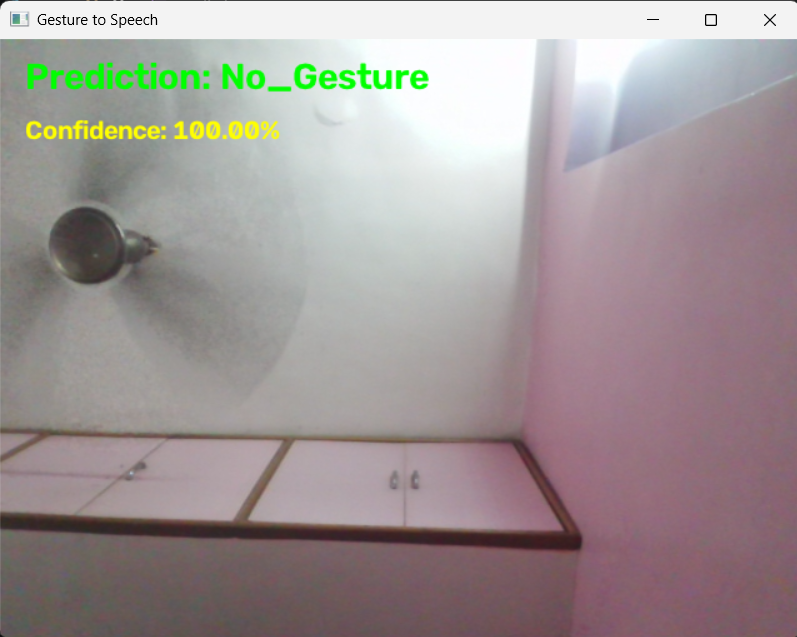

# MudraAI
# Vision-Based Real-Time Gesture-to-Speech Translation

A webcam-based gesture-to-speech application that recognizes the static hand signs **A**, **B**, and **C**. MediaPipe extracts hand landmarks and a neural network classifies their positions. A fourth `No_Gesture` class prevents blank and unrelated hand poses from being treated as signs.

## Features

- Real-time webcam prediction for A, B, C, and `No_Gesture`
- Confidence score displayed on screen
- Text-to-speech output for A, B, and C
- No speech for `No_Gesture`
- Landmark training pipeline with normalization, validation split, early stopping, class weighting, and checkpointing

## Tech Stack

- Python 3.x
- OpenCV for live webcam capture and display
- MediaPipe for hand detection and landmark extraction
- TensorFlow / Keras for landmark model training and inference
- NumPy for landmark feature processing
- pyttsx3 for offline text-to-speech conversion

## System Architecture

The system follows a simple vision-to-speech pipeline:



The application detects a hand in each live frame, extracts and normalizes its 21 landmarks, and sends the 63 landmark coordinates to the trained classifier. If no hand is detected, the result is `No_Gesture`. A prediction must remain stable across several frames before speech is produced.

## How It Works

1. The webcam captures a live image frame.
2. The 21 hand landmarks are normalized relative to the wrist and hand scale.
3. The trained landmark model predicts one of four classes: A, B, C, or `No_Gesture`.
4. The predicted class and confidence score are displayed on the screen.
5. If the class is `No_Gesture`, the system remains silent.
6. If the gesture is A, B, or C and the confidence is sufficiently high, the corresponding word is spoken aloud.
7. The loop continues until the user presses `Q` to exit.

The app speaks a letter only once for each stable gesture. It stays silent while the same gesture remains visible and speaks again only after the detected class changes or `No_Gesture` resets the speech state.

## Dataset

The dataset is organized as follows:

```text
dataset/
|-- A/              3,000 images
|-- B/              3,000 images
|-- C/              3,000 images
|-- No_Gesture/       500 images  # random non-target hand poses
`-- nothing/         3,000 images  # blank scenes
```

The A, B, and C gesture images are sourced from the [ASL Alphabet Dataset on Kaggle](https://www.kaggle.com/datasets/grassknoted/asl-alphabet?resource=download). `No_Gesture` and `nothing` are two source folders for one model output class, `No_Gesture`. Both produce a visible `No_Gesture` prediction and no speech.

## Model

The landmark model receives **63 values**: x, y, and z coordinates for 21 normalized hand landmarks. It uses:

```text
Input (21 landmarks x 3 coordinates)
  -> Dense (128) + dropout
  -> Dense (64) + dropout
  -> Softmax output (A / B / C / No_Gesture)
```

The model is optimized with Adam (`learning_rate=0.001`). The best validation-loss checkpoint is saved to `models/gesture_landmark_model.keras`.

## Results

The trained model correctly recognized each gesture in the live webcam test. Watch the [gesture prediction demo](assets/results/gesturepredictions.mp4), then see the screenshots below.

| A | B |
|---|---|
|  |  |

| C | No Gesture |
|---|---|
|  |  |

The recent random held-out landmark split reached **99.89% validation accuracy**. This score reflects the collected landmark samples; live performance can still vary with hand orientation, camera angle, lighting, and poses not represented in the dataset.

## How to Run

From the `gesture-to-speech-cnn` directory:

```powershell
cd gesture-to-speech-cnn
python -m venv venv
.\venv\Scripts\Activate
python -m pip install -r requirements.txt
```

To collect random non-target hand poses into `dataset/No_Gesture`:

```powershell
python capture_nogesture.py
```

To collect blank scenes into `dataset/nothing`:

```powershell
python capture_nothing.py
```

Train or retrain the landmark model. Training applies the same MediaPipe landmark preprocessing used by the live application:

```powershell
python train.py
```

This model uses normalized 21-point hand landmarks. Images without a detected hand become `No_Gesture`; random hand poses must be collected in `dataset/No_Gesture` so they learn rejection instead of being forced into A, B, or C.

The landmark model is saved to `models/gesture_landmark_model.keras`. Start the application with:

```powershell
python app.py
```

Press `Q` in the webcam window to quit.

### Collecting Additional Images

```powershell
python capture_data.py
python capture_nogesture.py
python capture_nothing.py
```

If you add or change dataset images, retrain the model:

```powershell
python train.py
```

## Project Structure

```text
gesture-to-speech-cnn/
|-- assets/results/       # Live prediction screenshots and live webcam test.
|-- dataset/              # A, B, C, No_Gesture, and nothing images
|-- models/               # Landmark model and MediaPipe task model
|-- references/           # Academic reference PDF
|-- app.py                # Real-time gesture-to-speech application
|-- capture_data.py       # A/B/C data collection
|-- capture_nogesture.py  # No_Gesture data collection
|-- capture_nothing.py    # blank-scene data collection
|-- gesture_utils.py      # Shared MediaPipe landmark preprocessing
|-- train.py              # Model training
`-- requirements.txt
```

## Student Details

- Student Name: Navya Roshni
- Roll No.: 5024142
- Semester: V
- Academic Year: 2026-2027
- Subject: AI
- Project Title: MudraAI
- Github Repository: https://github.com/c0dengineer

## Reference

This project is inspired by:

Gogoi, P., Karsh, B., Karsh, R. K., Laskar, R. H., & Bhuyan, M. K. (2025). *Vision-Based Real-Time Gesture-to-Speech Translation for Sign Language*. Procedia Computer Science, 258, 2050–2059. https://doi.org/10.1016/j.procs.2025.04.455

The supplied paper is included in this repository: [Vision-Based Real-Time Gesture-to-Speech Translation for Sign (PDF)](references/Vision-Based-Real-Time-Gesture-to-Speech-Translation-for-Sign.pdf).

### Dataset Reference

Akash Nag. *ASL Alphabet*. Kaggle. https://www.kaggle.com/datasets/grassknoted/asl-alphabet

The A, B, and C images used by this project are derived from this dataset. `No_Gesture` images were collected locally for this project.

This is a small academic implementation.
